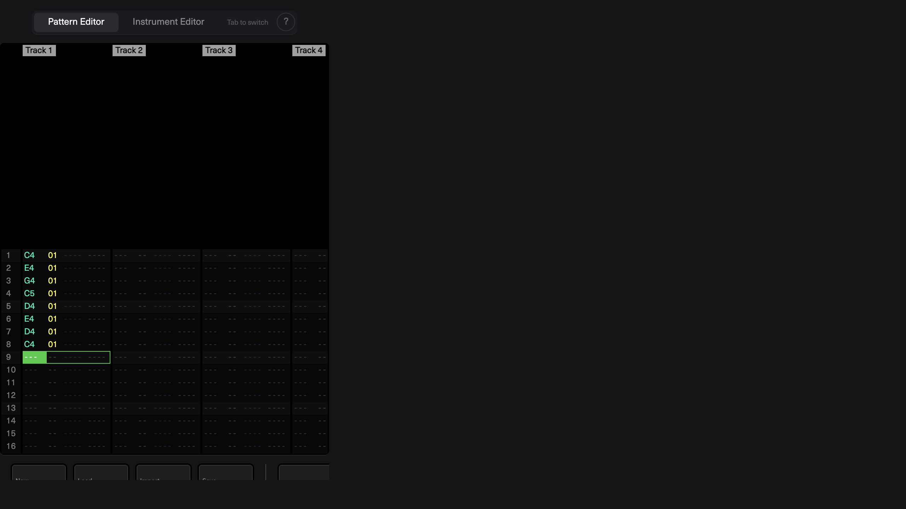
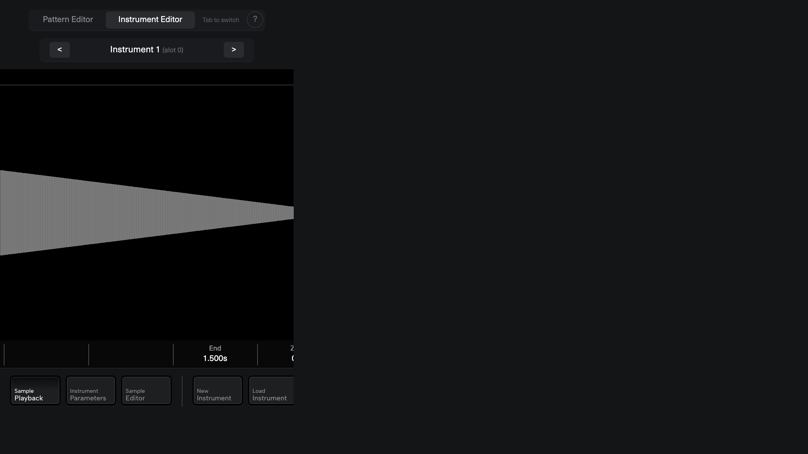

# Polyend Tracker — Unified Editor

A web-based editor for creating, editing, and playing **Polyend Tracker patterns and instruments**.\
Built with [`tracker-lib`](https://github.com/polyend/tracker-lib), Vue 3, and Elementary Audio.






## Features

### Pattern Editor
- Full step sequencer: Note, Instrument, FX1, and FX2 lanes
- Live playback with adjustable BPM (20–300)
- Record mode with QWERTY keyboard note input
- Overlay menus for instrument and effect selection
- Multiple track support (Tracker+ / OG Tracker)

### Instrument Editor
- **Playmodes:** OneShot, Forward/Backward/Pingpong Loop, Slice, Beat Slice, Wavetable, Granular
- **Sample Editor:** Cut, Fade In/Out, Normalize, Compress (with threshold/ratio), 3-band Equalizer
- **Sample Recorder:** Record from mic/line-in, MIDI-triggered auto-sampling
- **Parameters:** Filter (LP/HP/BP with cutoff + resonance), Tuning (±24 semitones + finetune), Volume, Panning, Overdrive, Bitcrush, Delay/Reverb sends
- **Automations (×6):** Volume, Pan, Cutoff, Wavetable Position, Granular Position, Finetune — each with ADSR envelope + LFO (Sine/Triangle/Saw/Square/Random)
- **Waveform Visualizer:** Zoom (mouse wheel), drag-to-seek, interactive region markers
- **QWERTY keyboard** note input (Z-M bottom row = white keys, S/D/G/H/J middle row = black keys)
- **MIDI** input/output support

### Import / Export
- **Import:** `.pti` instruments, `.mtp` patterns, original Polyend Tracker project folders (`project.mt` + `patterns/*.mtp` + `*.pti`)
- **Export:** `.pti` (instrument), `.mtp` (pattern), `.mid` (MIDI file), **Ableton Live 12** project (`.zip` with `.als` + samples), `.wav` (sample only)
- **Persistence:** Instruments auto-saved to IndexedDB (survives page reloads)


## Tech Stack

| Area | Technology |
|------|-----------|
| Framework | [Vue 3](https://vuejs.org/) (Composition API, `<script setup>`) |
| Audio | [Elementary Audio](https://elementary.audio/) |
| Waveform | [WaveSurfer.js](https://wavesurfer.xyz/) v7 + Regions plugin |
| File I/O | [`tracker-lib`](https://github.com/polyend/tracker-lib) (`.pti`/`.mtp`/`.mt`) |
| MIDI | [WebMidi.js](https://webmidijs.org/) |
| Styling | SCSS, custom dark theme |


## Quick Start

```bash
npm install
npm run dev
# Open http://localhost:5173
```

### Scripts

| Command | Description |
|---------|------------|
| `npm run dev` | Development server with hot reload |
| `npm run build` | Production build |
| `npm run lint` | ESLint |
| `npm run typecheck` | TypeScript validation |
| `npm run test` | Formatting + lint + typecheck |


## Keyboard Shortcuts

### Pattern Editor
| Key | Action |
|-----|--------|
| `Tab` | Switch Pattern / Instrument view |
| `Space` | Play / Stop |
| `Esc` | Toggle Record mode |
| `←↑↓→` | Navigate grid |
| `1` / `2` / `3` / `4` | Select attribute: Note / Instrument / FX1 / FX2 |
| `Z`–`M`, `,` | Input notes (C to C, bottom row = white keys) |
| `S` `D` `G` `H` `J` | Input sharps/flats (C# D# F# G# A#) |
| `.` / `/` | Octave down / up |
| `0`–`9` | Numeric input (in record mode) |
| `Ctrl`+`↑↓` | Fine-tune ±1 |
| `Ctrl`+`←→` | Coarse change ±10 (±12 for notes) |
| `Delete` | Clear step (record mode) |

### Instrument Editor
| Key | Action |
|-----|--------|
| `Tab` | Switch Instrument / Pattern view |
| `Z`–`M`, `,` | Play notes (hold to sustain) |
| `S` `D` `G` `H` `J` | Play sharps/flats |
| `.` / `/` | Octave down / up |


## 🙏 Credits

This project is a fork of the original **[Polyend Tracker Instrument Editor](https://github.com/polyend/tracker-unified-editor)** by **Sandro "Sandroid" Ducceschi**. Huge thanks to Sandro for:
- The initial codebase and vision for a web-based Tracker editor
- Creating and maintaining [`tracker-lib`](https://github.com/polyend/tracker-lib)
- The original instrument editor, sample recorder, and audio engine

Additional features in this fork:
- Pattern Editor with step sequencing and live playback
- Beat Slice mode with per-note slice triggering
- Ableton Live project export, MIDI export
- Full Tracker project import, IndexedDB persistence
- Built-in help guide, improved zoom, UI refinements


## License

This project is licensed under **CC BY-NC 4.0** (Creative Commons Attribution-NonCommercial 4.0).

[`tracker-lib`](https://github.com/polyend/tracker-lib) is licensed under MIT.

See [LICENSE](./LICENSE) for full details.

